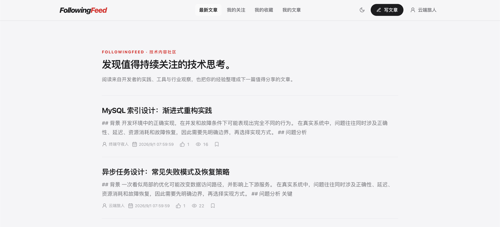

# FollowingFeed

FollowingFeed 是一个使用 Go 与 Next.js 构建的技术内容社区，覆盖用户认证、
文章状态流转、社交关系、关注 Feed 和互动统计。项目以模块化单体交付，
重点展示分层设计、事务一致性、
缓存策略、幂等写入、数据库索引以及可复现的全栈工程化能力。

## 页面预览



## 核心能力

- 用户注册、登录、访问令牌刷新、会话注销和个人资料；
- 文章草稿、发布、撤回、软删除及公开文章列表；
- 关注、取消关注、关注状态、关注列表和粉丝列表；
- 基于拉模式的关注 Feed；
- 阅读、点赞、收藏、取消操作及用户收藏列表；
- Redis 有效会话白名单、请求限流、热点缓存和缓存击穿保护；
- MySQL 事务、唯一约束、复合索引和版本化迁移；
- OpenAPI 3.0、可配置 Swagger UI、健康检查、结构化日志和 Prometheus/Grafana 监控；
- 单元测试、真实 MySQL 集成测试，以及基于 MySQL/Redis 的 HTTP 端到端测试。

## 技术栈

| 层次       | 技术                                  |
| ---------- | ------------------------------------- |
| Web        | Next.js 16、React、TypeScript         |
| API        | Go 1.26.5、Gin、Wire                  |
| 数据       | MySQL 8.0、GORM、版本化 SQL Migration |
| 缓存与会话 | Redis 7.4、go-redis、singleflight     |
| 安全       | JWT、bcrypt、CORS、Redis 限流         |
| 可观测性   | Zap、Prometheus、Grafana              |
| 测试       | Testify、GoMock、sqlmock、HTTP E2E    |
| 交付       | Docker、Docker Compose、OpenAPI 3.0   |

详细的事务边界、Feed SQL、索引、互动幂等和缓存一致性说明见
[架构文档](docs/architecture.md)。

## 快速开始

### 运行前提

- Docker Desktop 或兼容 Docker Compose 的运行环境；
- 基础业务环境需要端口 `3000`、`6379`、`8080`、`8081` 和 `13306`；
- 启用可选监控环境时还需要 `3001` 和 `9090`。

只有源码开发和本机构建才需要 Go 1.26.5 与 Node.js 22。

### 1. 准备本地配置

```bash
cp .env.example .env
```

示例密钥仅供本地开发。生产环境必须使用独立生成的高强度密钥。

### 2. 启动业务环境

```bash
docker compose up -d --build
```

Compose 会按依赖关系完成以下流程：

```text
MySQL healthy → 数据库迁移成功 ┐
                              ├→ Go API → Next.js Web
Redis healthy ────────────────┘
```

不需要额外执行 `make migrate-up`。

### 3. 验证服务

```bash
docker compose ps -a
curl http://localhost:8080/health/ready
curl http://localhost:8081/metrics
```

| 服务         | 地址或预期状态                             |
| ------------ | ------------------------------------------ |
| Web          | <http://localhost:3000>                    |
| API          | <http://localhost:8080>                    |
| Swagger UI   | <http://localhost:8080/swagger/index.html> |
| OpenAPI YAML | <http://localhost:8080/openapi.yaml>       |
| migrate      | `Exited (0)`                               |
| MySQL、Redis | `healthy`                                  |

### 4. 按需启用监控

监控组件配置集中在 [`observability/`](observability/) 目录，并放在 Compose 的
`observability` Profile 中，普通业务开发不会默认启动：

```bash
make observability-up
```

| 服务       | 地址                                        |
| ---------- | ------------------------------------------- |
| Prometheus | <http://localhost:9090>                     |
| Grafana    | <http://localhost:3001>（默认 admin/admin） |

Grafana 会自动加载 Prometheus 数据源与 `FollowingFeed Overview` Dashboard。
基线流量、报告对比和指标含义统一见
[本地可观测性使用指南](docs/observability.md)，避免在 README 重复维护。

### 5. 停止服务

```bash
docker compose down
```

该命令保留 MySQL 数据卷。只有确定要清空本地数据时才使用
`docker compose down -v`。

## 源码开发

源码运行会读取本地 YAML 配置，先复制示例文件，再启动业务依赖并执行迁移：

```bash
cp config/dev.example.yaml config/dev.yaml
docker compose up -d mysql redis
make migrate-up
go run .
```

需要指标面板时再运行 `make observability-up`。

另开终端启动前端：

```bash
cd web
npm ci
npm run dev
```

浏览器请求通过 `NEXT_PUBLIC_API_BASE` 访问 API；Next.js 服务端渲染通过
`INTERNAL_API_BASE` 访问 API。在 Compose 网络中，后者应为
`http://api:8080/api/v1`，不能配置成容器自身的 `localhost`。
`NEXT_PUBLIC_API_BASE` 会写入前端构建产物，必须在 `npm run build` 前确定；
`INTERNAL_API_BASE` 由 Next.js 服务端在运行时读取。

## 验证与构建

```bash
make fmt
make test
make test-integration
make check-migrations
make vet
make web-build
make verify
docker build -t followingfeed-api .
```

`make test` 只运行不依赖外部服务的单元测试；`make test-integration` 会启动一次性 MySQL
8.0 容器，先验证迁移，再运行仓储并发测试和查询超时测试。测试使用专用 DSN，不读取开发
`.env`，完成后会自动删除容器。`make check-migrations` 也使用一次性 MySQL，仅执行迁移检查。
`make verify` 会执行该迁移检查，并额外执行 Go Vet、前端 lint/格式检查、生产构建和
Compose 配置检查，因此需要可用的 Docker daemon。使用一次性 MySQL、Redis 的
隔离端到端测试显式运行：

```bash
make test-e2e
```

集成与端到端测试使用动态数据并精确清理自身记录，不会清空业务表。

迁移检查依次验证：MySQL 可以从空库启动、全部 SQL 能成功执行、每个版本均已登记且没有
dirty 状态、最终业务表与索引结构符合预期，以及重复执行不会再次应用历史版本。任一步失败都会
使命令和 `make verify` 返回非零退出码。

`docker build` 只构建 API 镜像；完整前后端环境使用 Docker Compose 构建。

## 三分钟演示

1. 打开首页和 Swagger UI，介绍公开文章列表、分页和 OpenAPI 契约。
2. 注册并登录演示账号，在“我的文章”发布一篇文章。
3. 打开文章详情，演示阅读、点赞、收藏和列表滚动位置恢复。
4. 使用第二个账号关注作者，在关注 Feed 中确认刚发布的文章。
5. 打开作者主页、个人资料与我的收藏，核对文章、粉丝和互动统计。
6. 访问 `/health/ready`，说明 MySQL、Redis 就绪检查以及迁移任务的启动顺序。

演示结束执行 `docker compose down`，保留数据供下次展示。

## API 与接口契约

OpenAPI 文件 [docs/api.yaml](docs/api.yaml) 是接口契约的唯一来源，并已编译进 API 服务。
运行后可通过 `/openapi.yaml` 获取原始契约；开发环境还可通过 `/swagger/index.html`
浏览和调试接口。`swagger.enabled` 只控制 Swagger UI，不影响 OpenAPI YAML。

主要接口分组：

| 模块       | 路径                                                      |
| ---------- | --------------------------------------------------------- |
| 用户认证   | `/api/v1/users/signup`、`login`、`refreshToken`、`logout` |
| 用户资料   | `/api/v1/users/profile`、`/api/v1/pub/users/:id/profile`  |
| 文章制作库 | `/api/v1/articles/*`                                      |
| 公开文章   | `/api/v1/pub/list`、`detail/:id`、`users/:id/articles`    |
| 关注与粉丝 | `/api/v1/users/:id/follow*`、`following*`、`followers`    |
| 关注 Feed  | `/api/v1/feed`                                            |
| 文章互动   | `/api/v1/pub/articles/*`                                  |
| 我的收藏   | `/api/v1/users/me/collections`                            |

完整请求参数、响应 Schema、鉴权要求和错误结构请直接查看 Swagger UI 或 OpenAPI YAML，
避免 README 与接口契约重复维护。

## 配置与密钥

配置优先级为：内置默认值 < YAML 配置 < `FOLLOWINGFEED_` 环境变量。启动时会先读取本地
`.env` 以补充尚未存在的环境变量，因此部署平台预先注入的变量仍保持最高优先级。
`.env` 与 `config/dev.yaml` 已被 Git 忽略。
本地 `config/dev.yaml` 保存端口、超时、服务地址等非敏感配置；`.env` 只保存数据库密码、
JWT 签名密钥等敏感值。生产环境使用部署平台的环境变量或 Secret 管理服务，不上传 `.env`。
MySQL 连接、网络读写和单条业务 SQL 超时分别由 `connect_timeout`、`read_timeout`、
`write_timeout` 和 `query_timeout` 控制；部署时应结合服务的延迟目标调整。

本地 Compose 变量以 [.env.example](.env.example) 为准，源码模式 YAML 以
[config/dev.example.yaml](config/dev.example.yaml) 为准。生产变量、密钥要求和发布步骤只在
[部署指南](docs/deployment.md) 维护。访问令牌密钥、刷新令牌密钥和数据库密码不得提交到
仓库、镜像或部署日志。

## 数据库迁移

应用启动不会自动修改表结构。源码部署时先执行：

```bash
make migrate-up
```

新增结构变更时，在 `migrations/` 添加顺序递增的 SQL 文件；不得重写已在任何需要保留的
数据库中执行过的迁移。迁移命令通过版本记录只执行
尚未应用的文件，并使用 checksum 检测历史文件改写、使用 dirty 状态阻止 DDL 部分成功后
继续发布。生产账号与故障恢复流程见[部署指南](docs/deployment.md)，不要依赖 GORM
`AutoMigrate`。

## 当前限制

- Feed 当前使用 offset/limit，深分页游标方案仍在规划中；
- 尚未提交规模化 `EXPLAIN ANALYZE` 与压测报告；
- 热点文章互动计数仍同步写 MySQL，尚未引入异步聚合链路；
- 缓存与数据库采用最终一致性，部分统计可能在短 TTL 内短暂陈旧。

这些边界及对应演进方案见 [架构文档](docs/architecture.md)。在完成性能验证前，
项目不宣称具备经过验证的完整高并发能力。

## 小服务器独立部署

生产配置使用 `compose.production.yaml`，不与本地 Compose 合并；默认仅绑定本机 3100/18080，
不占用主站 3000，不接入主站数据库。配置、账号初始化与验收步骤见
[小服务器部署说明](docs/production-small-server.md)。

安全行为变更：Redis 使用有效会话白名单；升级后旧会话失效，Redis 重启后需重新登录。
生产模板关闭 Redis 快照/AOF，避免恢复旧会话。生产模板默认关闭注册与发布，内部验收后按需开放。
新增前端回归测试通过 `npm --prefix web test` 执行；完整隔离 HTTP 测试运行 `make test-e2e`。
