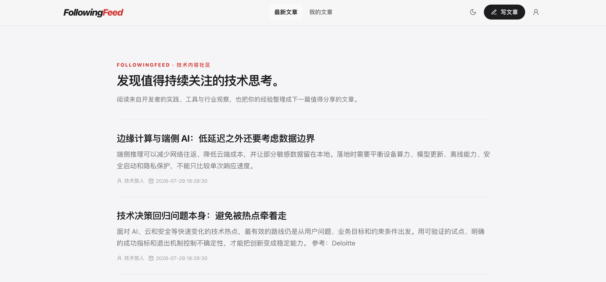

# FollowingFeed

FollowingFeed 是一个 Go + Next.js 实现的技术内容社区。当前已支持邮箱注册登录、昵称、草稿保存、文章发布/撤回/删除、公开文章列表与详情。

## 页面预览


## 运行前提

- Go 1.26.5
- Node.js 22（前端开发）
- MySQL 8.0、Redis 7.4

## 本地启动

1. 启动本地基础依赖（仅 MySQL 和 Redis）：

   ```bash
   docker compose up -d mysql redis
   ```

   > 当前 `docker-compose.yaml` 不包含 API 和前端服务；请继续执行下面的步骤分别启动后端与前端。

2. 从唯一的开发模板创建本地配置。`config/dev.yaml` 与 `.env` 均被 Git 忽略：

   ```bash
   cp config/dev.example.yaml config/dev.yaml
   cp .env.example .env
   ```

3. 执行数据库迁移：

   ```bash
   make migrate-up
   ```

4. 启动 API：

   ```bash
   go run .
   ```

5. 启动前端：

   ```bash
   cd web
   npm ci
   npm run dev
   ```

前端默认访问 `http://localhost:3000`，API 默认监听 `http://localhost:8080`。

## 配置与密钥

应用会先读取本地 `.env`，随后读取 YAML 默认配置；部署平台注入的 `FOLLOWINGFEED_` 环境变量优先级最高。`.env` 和 `config/dev.yaml` 都已被 Git 忽略。

`.env` 只保存密码、JWT 密钥等隐私信息。生产环境不复制 `.env` 文件，而是由部署平台注入以下变量：

```text
FOLLOWINGFEED_ENV=production
FOLLOWINGFEED_MYSQL_HOST=...
FOLLOWINGFEED_MYSQL_PORT=3306
FOLLOWINGFEED_MYSQL_USER=...
FOLLOWINGFEED_MYSQL_PASSWORD=...
FOLLOWINGFEED_MYSQL_DATABASE=...
FOLLOWINGFEED_REDIS_ADDR=...
FOLLOWINGFEED_JWT_ACCESS_TOKEN_KEY=<32 字符以上随机值>
FOLLOWINGFEED_JWT_REFRESH_TOKEN_KEY=<32 字符以上随机值>
FOLLOWINGFEED_CORS_ALLOWED_ORIGINS=https://app.example.com
```

JWT 密钥、生产数据库密码和生产 Redis 凭据不得提交到 Git 仓库。生产容器不携带开发配置文件。

## 迁移

应用启动不会自动修改表结构。部署前执行：

```bash
make migrate-up
```

新增表结构变更时，在 `migrations/` 新增顺序递增的 SQL 文件后再发布；迁移命令会按文件名顺序执行尚未记录的版本。不要直接依赖 GORM `AutoMigrate` 修改生产库。

## 健康检查

- `GET /health/live`：进程存活。
- `GET /health/ready`：MySQL 与 Redis 均可用。

## 核心 API

```text
POST /api/v1/users/signup
POST /api/v1/users/login
GET  /api/v1/users/profile                 Authorization: Bearer <token>
POST /api/v1/users/refreshToken            Authorization: Bearer <refresh-token>
POST /api/v1/users/logout                  Authorization: Bearer <token>

POST /api/v1/articles/edit                 Authorization: Bearer <token>
POST /api/v1/articles/publish              Authorization: Bearer <token>
POST /api/v1/articles/withdraw             Authorization: Bearer <token>
POST /api/v1/articles/delete               Authorization: Bearer <token>
GET  /api/v1/articles/list                 Authorization: Bearer <token>
GET  /api/v1/articles/detail/:id           Authorization: Bearer <token>
GET  /api/v1/pub/list
GET  /api/v1/pub/detail/:id
```

完整接口草案见 [docs/api.yaml](docs/api.yaml)。

## 验证与构建

```bash
make fmt
make test
make vet
make web-build
docker build -t followingfeed-api .
```

上面的 Docker 命令仅构建 API 镜像，不包含前端应用。

生产部署步骤见 [docs/deployment.md](docs/deployment.md)。
